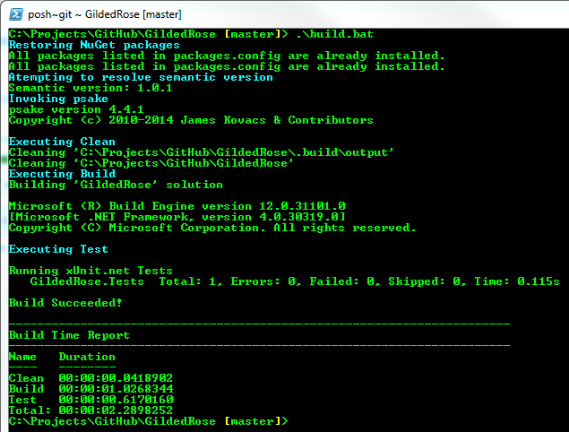

# Gilded Rose Refactoring Kata

Hi and welcome to team Gilded Rose. As you know, we are a small inn with a 
prime location in a prominent city run by a friendly innkeeper named 
Allison. We also buy and sell only the finest goods. Unfortunately, our 
goods are constantly degrading in quality as they approach their sell by 
date. We have a system in place that updates our inventory for us. It was 
developed by a no-nonsense type named Leeroy, who has moved on to new 
adventures. Your task is to add the new feature to our system so that we 
can begin selling a new category of items. First an introduction to our 
system:

- All items have a SellIn value which denotes the number of days we have 
to sell the item
- All items have a Quality value which denotes how valuable the item is
- At the end of each day our system lowers both values for every item

Pretty simple, right? Well this is where it gets interesting:

- Once the sell by date has passed, Quality degrades twice as fast
- The Quality of an item is never negative
- "Aged Brie" actually increases in Quality the older it gets
- The Quality of an item is never more than 50
- "Sulfuras", being a legendary item, never has to be sold or decreases 
in Quality
- "Backstage passes", like aged brie, increases in Quality as it's SellIn 
value approaches; Quality increases by 2 when there are 10 days or less 
and by 3 when there are 5 days or less but Quality drops to 0 after the 
concert

We have recently signed a supplier of conjured items. This requires an 
update to our system:

- "Conjured" items degrade in Quality twice as fast as normal items

Feel free to make any changes to the UpdateQuality method and add any 
new code as long as everything still works correctly. However, do not 
alter the Item class or Items property as those belong to the goblin 
in the corner who will insta-rage and one-shot you as he doesn't 
believe in shared code ownership (you can make the UpdateQuality 
method and Items property static if you like, we'll cover for you).

Just for clarification, an item can never have its Quality increase 
above 50, however "Sulfuras" is a legendary item and as such its 
Quality is 80 and it never alters.

## Getting Started

Clone the repository. Run build.bat from Powershell. If you see 
output similar to the following screenshot, you are ready to 
start refactoring.
    

## Who, What, Why?
Who: [@TerryHughes](https://twitter.com/TerryHughes), [@NotMyself](https://twitter.com/NotMyself)

What & Why: [Refactor This: The Gilded Rose Kata](http://iamnotmyself.com/2011/02/13/refactor-this-the-gilded-rose-kata/)

## License

MIT

## Suggested attribution

This work is by [@TerryHughes](https://twitter.com/TerryHughes), [@NotMyself](https://twitter.com/NotMyself)

The repository can be found at [https://github.com/NotMyself/GildedRose](https://github.com/NotMyself/GildedRose)

# Readme from the GE Fork

# Gilded Rose Kata

This Kata was originally created by Terry Hughes (http://twitter.com/TerryHughes). It is already on GitHub [here](https://github.com/NotMyself/GildedRose). See also [Bobby Johnson's description of the kata](http://iamnotmyself.com/2011/02/13/refactor-this-the-gilded-rose-kata/).

Test fixtures for Text-Based approval testing with TextTest (see [the TextTests](https://github.build.ge.com/Aviation-Dev-Chapter/gilded-rose/tree/master/texttests))

As Bobby Johnson points out in his article ["Why Most Solutions to Gilded Rose Miss The Bigger Picture"](http://iamnotmyself.com/2012/12/07/why-most-solutions-to-gilded-rose-miss-the-bigger-picture), it'll actually give you
better practice at handling a legacy code situation.

Here's a good article on writing tests for Gilded Rose ["Writing Good Tests for the Gilded Rose Kata"](http://coding-is-like-cooking.info/2013/03/writing-good-tests-for-the-gilded-rose-kata/) about how you could use this kata in a [coding dojo](https://leanpub.com/codingdojohandbook).

## How to use this Kata

The simplest way is to just clone the code and start hacking away improving the design. You'll want to look at the ["Gilded Rose Requirements"](https://github.build.ge.com/Aviation-Dev-Chapter/gilded-rose/blob/master/GildedRoseRequirements.txt) which explains what the code is for. I strongly advise you that you'll also need some tests if you want to make sure you don't break the code while you refactor.

You could write some unit tests yourself, using the requirements to identify suitable test cases. I've provided a failing unit test in a popular test framework as a starting point for most languages.

Whichever testing approach you choose, the idea of the exercise is to do some deliberate practice, and improve your skills at designing test cases and refactoring. The idea is not to re-write the code from scratch, but rather to practice designing tests, taking small steps, running the tests often, and incrementally improving the design.
